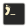
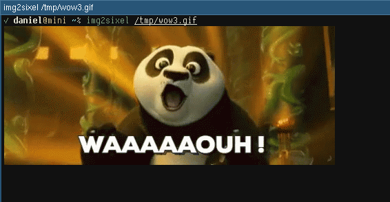

#  foot

The fast, lightweight and minimalistic Wayland terminal emulator.

[](https://ci.codeberg.org/dnkl/foot)
[](https://gitlab.com/dnkl/foot/commits/master)
[](https://builds.sr.ht/~dnkl/foot?)

[](https://repology.org/project/foot/versions)


## Index

1. [Features](#features)
1. [Installing](#installing)
1. [Configuration](#configuration)
1. [Troubleshooting](#troubleshooting)
1. [Why the name 'foot'?](#why-the-name-foot)
1. [Fonts](#fonts)
1. [Shortcuts](#shortcuts)
   1. [Keyboard](#keyboard)
      1. [Normal mode](#normal-mode)
      1. [Scrollback search](#scrollback-search)
   1. [Mouse](#mouse)
1. [Server (daemon) mode](#server-daemon-mode)
1. [URLs](#urls)
1. [Shell integration](#shell-integration)
   1. [Current working directory](#current-working-directory)
   1. [Jumping between prompts](#jumping-between-prompts)
1. [Alt/meta](#alt-meta)
1. [Backspace](#backspace)
1. [Keypad](#keypad)
1. [DPI and font size](#dpi-and-font-size)
1. [Supported OSCs](#supported-oscs)
1. [Programmatically checking if running in foot](#programmatically-checking-if-running-in-foot)
1. [XTGETTCAP](#xtgettcap)
1. [Credits](#Credits)
1. [Bugs](#bugs)
1. [Contact](#contact)
   1. [IRC](#irc)
   1. [Mastodon](#mastodon)
1. [Sponsoring/donations](#sponsoring-donations)
1. [License](#license)


## Features

* Fast (see [benchmarks](doc/benchmark.md), and
  [performance](https://codeberg.org/dnkl/foot/wiki/Performance))
* Lightweight, in dependencies, on-disk and in-memory
* Wayland native
* DE agnostic
* Server/daemon mode
* User configurable font fallback
* On-the-fly font resize
* On-the-fly DPI font size adjustment
* Scrollback search
* Keyboard driven URL detection
* Color emoji support
* IME (via `text-input-v3`)
* Multi-seat
* True Color (24bpp)
* [Synchronized Updates](https://gitlab.freedesktop.org/terminal-wg/specifications/-/merge_requests/2) support
* [Sixel image support](https://en.wikipedia.org/wiki/Sixel)

  


# Installing

See [INSTALL.md](INSTALL.md).


## Configuration

**foot** can be configured by creating a file
`$XDG_CONFIG_HOME/foot/foot.ini` (defaulting to
`~/.config/foot/foot.ini`).  A template for that can usually be found
in `/etc/xdg/foot/foot.ini` or
[here](https://codeberg.org/dnkl/foot/src/branch/master/foot.ini).

Further information can be found in foot's man page `foot.ini(5)`.


## Troubleshooting

See the [wiki](https://codeberg.org/dnkl/foot/wiki#user-content-troubleshooting)


## Why the name 'foot'?

I'm bad at names. Most of my projects usually start out as _foo
something_ (for example, [yambar](https://codeberg.org/dnkl/yambar)
was _f00bar_ for a while).

So why _foot_?

_foo terminal_ → _footerm_ → _foot_

Pretty bad, I know.

As a side note, if you pronounce the _foo_ part of _foot_ the same way
you pronounce _foobar_, then _foot_ sounds a lot like the Swedish word
_fot_, which incidentally means (you guessed it) _foot_.


## Fonts

**foot** supports all fonts that can be loaded by _freetype_,
including **bitmap** fonts and **color emoji** fonts.

Foot uses _fontconfig_ to locate and configure the font(s) to
use. Since fontconfig's fallback mechanism is imperfect, especially
for monospace fonts (it doesn't prefer monospace fonts even though the
requested font is one), foot allows you, the user, to configure the
fallback fonts to use.

This also means you can configure _each_ fallback font individually;
you want _that_ fallback font to use _this_ size, and you want that
_other_ fallback font to be _italic_?  No problem!

If a glyph cannot be found in _any_ of the user configured fallback
fonts, _then_ fontconfig's list is used.


## Shortcuts

These are the default shortcuts. See `man foot.ini` and the example
`foot.ini` to see how these can be changed.


### Keyboard

#### Normal mode

<kbd>shift</kbd>+<kbd>page up</kbd>/<kbd>page down</kbd>
: Scroll up/down in history

<kbd>ctrl</kbd>+<kbd>shift</kbd>+<kbd>c</kbd>, <kbd>XF86Copy</kbd>
: Copy selected text to the _clipboard_

<kbd>ctrl</kbd>+<kbd>shift</kbd>+<kbd>v</kbd>, <kbd>XF86Paste</kbd>
: Paste from _clipboard_

<kbd>shift</kbd>+<kbd>insert</kbd>
: Paste from the _primary selection_

<kbd>ctrl</kbd>+<kbd>shift</kbd>+<kbd>r</kbd>
: Start a scrollback search

<kbd>ctrl</kbd>+<kbd>+</kbd>, <kbd>ctrl</kbd>+<kbd>=</kbd>
: Increase font size by 0,5pt

<kbd>ctrl</kbd>+<kbd>-</kbd>
: Decrease font size by 0,5pt

<kbd>ctrl</kbd>+<kbd>0</kbd>
: Reset font size

<kbd>ctrl</kbd>+<kbd>shift</kbd>+<kbd>n</kbd>
: Spawn a new terminal. If the shell has been [configured to emit the
  OSC 7 escape
  sequence](https://codeberg.org/dnkl/foot/wiki#user-content-spawning-new-terminal-instances-in-the-current-working-directory),
  the new terminal will start in the current working directory.

<kbd>ctrl</kbd>+<kbd>shift</kbd>+<kbd>u</kbd>
: Enter URL mode, where all currently visible URLs are tagged with a
  jump label with a key sequence that will open the URL.

<kbd>ctrl</kbd>+<kbd>shift</kbd>+<kbd>z</kbd>
: Jump to the previous, currently not visible, prompt. Requires [shell
  integration](https://codeberg.org/dnkl/foot/wiki#user-content-jumping-between-prompts).

<kbd>ctrl</kbd>+<kbd>shift</kbd>+<kbd>x</kbd>
: Jump to the next prompt. Requires [shell
  integration](https://codeberg.org/dnkl/foot/wiki#user-content-jumping-between-prompts).


#### Scrollback search

<kbd>ctrl</kbd>+<kbd>r</kbd>
: Search _backward_ for next match

<kbd>ctrl</kbd>+<kbd>s</kbd>
: Search _forward_ for next match

<kbd>ctrl</kbd>+<kbd>w</kbd>
: Extend current selection (and thus the search criteria) to the end
  of the word, or the next word if currently at a word separating
  character.

<kbd>ctrl</kbd>+<kbd>shift</kbd>+<kbd>w</kbd>
: Same as <kbd>ctrl</kbd>+<kbd>w</kbd>, except that the only word
  separating characters are whitespace characters.

<kbd>ctrl</kbd>+<kbd>v</kbd>, <kbd>ctrl</kbd>+<kbd>shift</kbd>+<kbd>v</kbd>, <kbd>ctrl</kbd>+<kbd>y</kbd>, <kbd>XF86Paste</kbd>
: Paste from clipboard into the search buffer.

<kbd>shift</kbd>+<kbd>insert</kbd>
: Paste from primary selection into the search buffer.

<kbd>escape</kbd>, <kbd>ctrl</kbd>+<kbd>g</kbd>
: Cancel the search

<kbd>return</kbd>
: Finish the search and copy the current match to the primary
  selection


### URL mode

<kbd>t</kbd>
: Toggle whether the URL is displayed in the jump label or not

<kbd>escape</kbd>, <kbd>ctrl</kbd>+<kbd>c</kbd>, <kbd>ctrl</kbd>+<kbd>g</kbd>, <kbd>ctrl</kbd>+<kbd>d</kbd>
: Exit URL mode without launching any URLs


### Mouse

<kbd>left</kbd> - **single-click**
: Drag to select; when released, the selected text is copied to the
  _primary_ selection. This feature is **disabled** when client has
  enabled _mouse tracking_.
: Holding <kbd>shift</kbd> enables selection in mouse tracking enabled
  clients.
: Holding <kbd>ctrl</kbd> will create a block selection.

<kbd>left</kbd> - **double-click**
: Selects the _word_ (separated by spaces, period, comma, parenthesis
  etc) under the pointer. Hold <kbd>ctrl</kbd> to select everything
  under the pointer up to, and until, the next space characters.

<kbd>left</kbd> - **triple-click**
: Selects the entire row

<kbd>middle</kbd>
: Paste from _primary_ selection

<kbd>right</kbd>
: Extend current selection. Clicking immediately extends the
  selection, while hold-and-drag allows you to interactively resize
  the selection.

<kbd>wheel</kbd>
: Scroll up/down in history


## Server (daemon) mode

When run normally, **foot** is a single-window application; if you
want another window, start another foot process.

However, foot can also be run in a _server_ mode. In this mode, one
process hosts multiple windows. All Wayland communication, VT parsing
and rendering is done in the server process.

New windows are opened by running `footclient`, which remains running
until the terminal window is closed, at which point it exits with the
exit value of the client process (typically the shell).

The point of this mode is **a)** reduced memory footprint - all
terminal windows will share fonts and glyph cache, and **b)** reduced
startup time - loading fonts and populating the glyph cache takes
time, but in server mode it only happens once.

The downside is a performance penalty; all windows' input and output
are multiplexed in the same thread (but each window will have its own
set of rendering threads). This means that if one window is very busy
with, for example, producing output, then other windows will suffer.

And of course, should the server process crash, **all** windows will
be gone.

Typical usage would be to start the server process (`foot --server`)
when starting your Wayland compositor (i.e. logging in to your
desktop), and then run `footclient` instead of `foot` whenever you
want to launch a new terminal.

Foot support socket activation, which means `foot --server` will only be
started the first time you'll run `footclient`. (systemd user units are
included, but it can work with other supervision suites).

## URLs

Foot supports URL detection. But, unlike many other terminal
emulators, where URLs are highlighted when they are hovered and opened
by clicking on them, foot uses a keyboard driven approach.

Pressing <kbd>ctrl</kbd>+<kbd>shift</kbd>+<kbd>u</kbd> enters _“URL
mode”_, where all currently visible URLs are underlined, and is
associated with a _“jump-label”_. The jump-label indicates the _key
sequence_ (e.g. **”AF”**) to use to activate the URL.

The key binding can, of course, be customized, like all other key
bindings in foot. See `show-urls-launch` and `show-urls-copy` in the
`foot.ini` man page.

`show-urls-launch` by default opens the URL with `xdg-open`. This can
be changed with the `url-launch` option.

`show-urls-copy` is an alternative to `show-urls-launch`, that changes
what activating a URL _does_; instead of opening it, it copies it to
the clipboard. It is unbound by default.

Jump label colors, the URL underline color, and the letters used in
the jump label key sequences can be configured.


## Shell integration

### Current working directory

New foot terminal instances (bound to
<kbd>ctrl</kbd>+<kbd>shift</kbd>+<kbd>n</kbd> by default) will open in
the current working directory, **if** the shell in the “parent”
terminal reports directory changes.

This is done with the OSC-7 escape sequence. Most shells can be
scripted to do this, if they do not support it natively. See the
[wiki](https://codeberg.org/dnkl/foot/wiki#user-content-spawning-new-terminal-instances-in-the-current-working-directory)
for details.


### Jumping between prompts

Foot can move the current viewport to focus prompts of already
executed commands (bound to
<kbd>ctrl</kbd>+<kbd>shift</kbd>+<kbd>z</kbd>/<kbd>x</kbd> by
default).

For this to work, the shell needs to emit an OSC-133;A
(`\E]133;A\E\\`) sequence before each prompt.

In zsh, one way to do this is to add a `precmd` hook:

```zsh
precmd() {
    print -Pn "\e]133;A\e\\"
}
```

See the
[wiki](https://codeberg.org/dnkl/foot/wiki#user-content-jumping-between-prompts)
for details, and examples for other shells.


## Alt/meta

By default, foot prefixes _Meta characters_ with ESC. This corresponds
to XTerm's `metaSendsEscape` option set to `true`.

This can be disabled programmatically with `\E[?1036l` (and enabled
again with `\E[?1036h`).

When disabled, foot will instead set the 8:th bit of meta character
and then UTF-8 encode it. This corresponds to XTerm's `eightBitMeta`
option set to `true`.

This can also be disabled programmatically with `rmm` (_reset meta
mode_, `\E[?1034l`), and enabled again with `smm` (_set meta mode_,
`\E[?1034h`).


## Backspace

Foot transmits DEL (`^?`) on <kbd>backspace</kbd>. This corresponds to
XTerm's `backarrowKey` option set to `false`, and to DECBKM being
_reset_.

To instead transmit BS (`^H`), press
<kbd>ctrl</kbd>+<kbd>backspace</kbd>.

Note that foot does **not** implement DECBKM, and that the behavior
described above **cannot** be changed.

Finally, pressing <kbd>alt</kbd> will prefix the transmitted byte with
ESC.


## Keypad

By default, <kbd>Num Lock</kbd> overrides the run-time configuration
keypad mode; when active, the keypad is always considered to be in
_numerical_ mode. This corresponds to XTerm's `numLock` option set to
`true`.

In this mode, the keypad keys always sends either numbers (<kbd>Num
Lock</kbd> is **active**) or cursor movement keys (<kbd>Up</kbd>,
<kbd>Down</kbd>, <kbd>Left</kbd>, <kbd>Right</kbd>, <kbd>Page
Up</kbd>, <kbd>Page Down</kbd> etc).

This can be disabled programmatically with `\E[?1035l` (and enabled
again with `\E[?1035h`).

When disabled, the keypad sends custom escape sequences instead of
numbers, when in _application_ mode.


## DPI and font size

Font sizes are apparently a complex thing. Many applications use a
fixed DPI of 96. They may also multiply it with the monitor's scale
factor.

This results in fonts with different **physical** sizes (i.e. if
measured by a ruler) when rendered on screens with different DPI
values. Even if the configured font size is the same.

This is not how it is meant to be. Fonts are measured in _point sizes_
**for a reason**; a given point size should have the same height on
all mediums, be it printers or monitors, regardless of their DPI.

Foot’s default behavior is to use the monitor’s DPI to size fonts when
output scaling has been disabled on **all** monitors. If at least one
monitor has output scaling enabled, fonts will instead by sized using
the scaling factor.

This can be changed to either **always** use the monitor’s DPI
(regardless of scaling factor), or to **never** use it, with the
`dpi-aware` option in `foot.ini`. See the man page, **foot.ini**(5)
for more information.

When fonts are sized using the monitor’s DPI, glyphs should always
have the same physical height, regardless of monitor.

Furthermore, foot will re-size the fonts on-the-fly when the window is
moved between screens with different DPIs values. If the window covers
multiple screens, with different DPIs, the highest DPI will be used.

_Note_: if you configure **pixelsize**, rather than **size**, then DPI
changes will **not** change the font size. Pixels are always pixels.


## Supported OSCs

OSC, _Operating System Command_, are escape sequences that interacts
with the terminal emulator itself. Foot implements the following OSCs:

* `OSC 0` - change window icon + title (but only title is actually
  supported)
* `OSC 2` - change window title
* `OSC 4` - change color palette
* `OSC 7` - report CWD (see [shell integration](#shell-integration))
* `OSC 8` - hyperlink
* `OSC 9` - desktop notification
* `OSC 10` - change (default) foreground color
* `OSC 11` - change (default) background color
* `OSC 12` - change cursor color
* `OSC 17` - change highlight (selection) background color
* `OSC 19` - change highlight (selection) foreground color
* `OSC 22` - set the xcursor (mouse) pointer
* `OSC 52` - copy/paste clipboard data
* `OSC 104` - reset color palette
* `OSC 110` - reset default foreground color
* `OSC 111` - reset default background color
* `OSC 112` - reset cursor color
* `OSC 117` - reset highlight background color
* `OSC 119` - reset highlight foreground color
* `OSC 133` - [shell integration](#shell-integration)
* `OSC 555` - flash screen (**foot specific**)
* `OSC 777` - desktop notification (only the `;notify` sub-command of
  OSC 777 is supported.)

See the **foot-ctlseq**(7) man page for a complete list of supported
control sequences.


## Programmatically checking if running in foot

Foot does **not** set any environment variables that can be used to
identify foot (reading `TERM` is not reliable since the user may have
chosen to use a different terminfo).

You can instead use the escape sequences to read the _Secondary_ and
_Tertiary Device Attributes_ (secondary/tertiary DA, for short).

The tertiary DA response is always `\EP!|464f4f54\E\\`, where
`464f4f54` is `FOOT` in hex.

The secondary DA response is `\E[>1;XXYYZZ;0c`, where `XXYYZZ` is
foot's major, minor and patch version numbers, in decimal, using two
digits for each number. For example, foot-1.4.2 would respond with
`\E[>1;010402;0c`.

**Note**: not all terminal emulators implement tertiary DA. Most
implement secondary DA, but not all. All _should_ however implement
_Primary DA_.

Thus, a safe way to query the terminal is to request the tertiary,
secondary and primary DA all at once, in that order. All terminals
should ignore escape sequences they do not recognize. You will have to
parse the response (which in foot will consist of all three DA
responses, all at once) to determine which requests the terminal
emulator actually responded to.

Starting with version 1.7.0, foot also implements `XTVERSION`, to
which it will reply with `\EP>|foot(version)\E\\`. Version is
e.g. “1.8.2” for a regular release, or “1.8.2-36-g7db8e06f” for a git
build.


# XTGETTCAP

`XTGETTCAP` is an escape sequence initially introduced by XTerm, and
also implemented (and extended, to some degree) by Kitty.

It allows querying the terminal for terminfo
capabilities. Applications using this feature do not need to use the
classic, file-based, terminfo definition. For example, if all
applications used this feature, you would no longer have to install
foot’s terminfo on remote hosts you SSH into.

XTerm’s implementation (as of XTerm-370) only supports querying key
(as in keyboard keys) capabilities, and three custom capabilities:

* `TN` - terminal name
* `Co` - number of colors (alias for the `colors` capability)
* `RGB` - number of bits per color channel (different semantics from
  the `RGB` capability in file-based terminfo definitions!).

Kitty has extended this, and also supports querying all integer and
string capabilities.

Foot supports this, and extends it even further, to also include
boolean capabilities. This means foot’s entire terminfo can be queried
via `XTGETTCAP`.

Note that both Kitty and foot handles **responses** to
multi-capability queries slightly differently, compared to XTerm.

XTerm will send a single DCS reply, with `;`-separated
capability/value pairs. There are a couple of issues with this:

* The success/fail flag in the beginning of the response is always `1`
  (success), unless the very **first** queried capability is invalid.
* XTerm will not respond **at all** to an invalid capability, unless
  it’s the first one in the `XTGETTCAP` query.
* XTerm will end the response at the first invalid capability.

In other words, if you send a large multi-capability query, you will
only get responses up to, but not including, the first invalid
capability. All subsequent capabilities will be dropped.

Kitty and foot on the other hand, send one DCS response for **each**
capability in the multi query. This allows us to send a proper
success/fail flag for each queried capability. Responses for **all**
queried capabilities are **always** sent. No queries are ever dropped.


# Credits

* [Ordoviz](https://codeberg.org/Ordoviz), for designing and
contributing foot's [logo](icons/hicolor/48x48/apps/foot.png).


# Bugs

Please report bugs to https://codeberg.org/dnkl/foot/issues

Before you open a new issue, please search existing bug reports, both
open **and** closed ones. Chances are someone else has already
reported the same issue.

The report should contain the following:

- Foot version (`foot --version`).
- Log output from foot (start foot from another terminal).
- Which Wayland compositor (and version) you are running.
- If reporting a crash, please try to provide a `bt full` backtrace
  with symbols.
- Steps to reproduce. The more details the better.


# Contact

## IRC

Ask questions, hang out, sing praise or just say hi in the `#foot`
channel on [irc.libera.chat](https://libera.chat). Logs are available
at https://libera.irclog.whitequark.org/foot.


## Mastodon

Every now and then I post foot related updates on
[@dnkl@linuxrocks.online](https://linuxrocks.online/@dnkl)


# Sponsoring/donations

* GitHub Sponsors: https://github.com/sponsors/dnkl


# License

Foot is released under the [MIT license](LICENSE).
