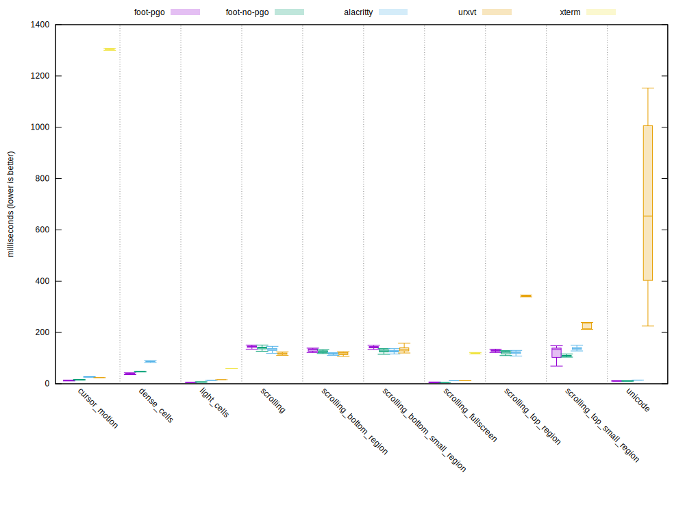

# Benchmarks

## vtebench

All benchmarks are done using [vtebench](https://github.com/alacritty/vtebench):

```sh
./target/release/vtebench -b ./benchmarks
```

## 2021-06-25

### System

CPU: i9-9900

RAM: 64GB

Graphics: Radeon RX 5500XT


### Terminal configuration

Geometry: 2040x1884

Font: Fantasque Sans Mono 10.00pt/23px

Scrollback: 10000 lines


### Results

| Benchmark (times in ms)       | Foot (GCC+PGO) 1.8.0 | Foot 1.8.0 | Alacritty 0.8.0 | URxvt 9.26 | XTerm 368 |
|-------------------------------|---------------------:|-----------:|----------------:|-----------:|----------:|
| cursor motion                 |                12.93 |      15.37 |           26.47 |      23.41 |   1304.00 |
| dense cells                   |                39.16 |      47.19 |           87.26 |    9110.00 |  10883.00 |
| light cells                   |                 5.34 |       6.42 |           12.76 |      16.00 |     60.00 |
| scrollling                    |               144.26 |     139.93 |          133.98 |     117.52 |   3772.67 |
| scrolling bottom region       |               130.81 |     125.34 |          116.10 |     117.31 |   3574.67 |
| scrolling bottom small region |               142.46 |     127.52 |          127.32 |     135.18 |   3572.67 |
| scrolling fullscreen          |                 5.43 |       5.27 |           12.06 |      11.97 |    118.62 |
| scrolling top region          |               129.05 |     120.24 |          121.65 |     341.70 |   3567.33 |
| scrolling top small region    |               121.59 |     109.82 |          137.03 |     219.96 |   3558.67 |
| unicode                       |                12.03 |      11.95 |           13.94 |     667.67 |   4905.67 |





## 2021-03-20

### System

CPU: i5-8250U

RAM: 8GB

Graphics: Intel UHD Graphics 620


### Terminal configuration

Geometry: 945x1020

Font: Dina:pixelsize=12

Scrollback=10000 lines


### Results


| Benchmark              | Foot (GCC+PGO) 1.7.0.r2 | Foot (no PGO) 1.7.0.r2 |    Alacritty 0.7.2 |       URxvt 9.22 |      St 0.8.4 |       XTerm 366 |
|------------------------|------------------------:|-----------------------:|-------------------:|-----------------:|--------------:|----------------:|
| alt-random             |           0.714s ±0.047 |          0.900s ±0.041 | 1.586s ±0.045      |    1.684s ±0.034 | 2.054s ±0.121 |  37.205s ±0.252 |
| alt-random-colors      |           0.736s ±0.054 |          0.950s ±0.082 | 1.565s ±0.043      |    2.150s ±0.137 | 2.195s ±0.154 |  33.112s ±0.167 |
| scrolling              |           1.593s ±0.070 |          1.559s ±0.055 | 1.517s ±0.079      |    1.462s ±0.052 | 3.308s ±0.133 | 134.432s ±0.436 |
| scrolling-filled-lines |           1.178s ±0.044 |          1.309s ±0.045 | 2.281s ±0.086      |    2.044s ±0.060 | 2.732s ±0.056 |  20.753s ±0.067 |
| unicode-random         |           0.349s ±0.009 |          0.352s ±0.007 | 0.148s ±0.010 [^1] |   19.090s ±0.363 |       crashed |  15.579s ±0.093 |

[^1]: [Alacritty and "unicode-random"](#alacritty-and-unicode-random)


# Alacritty and "unicode-random"

Alacritty is actually **really** slow at rendering this (whether it is
fallback fonts in general, emojis, or something else, I don't know).

I believe the reason it finishes the benchmark so quickly is because
it reads from the PTY in a separate thread, into a larger receive
buffer which is then consumed by the main thread. This allows the
client program to write its output much faster since it is no longer
stalling on a blocked PTY.

This means Alacritty only needs to render a couple of frames since it
can reach the final VT state almost immediately.

On the other hand, `cat`:ing the `unicode-random` test file in an
endless loop, or just manually scrolling up after the benchmark is
done is **slow**, which besides being felt (input lag), can be seen by
setting `debug.render_timer = true` in `alacritty.yml`.
