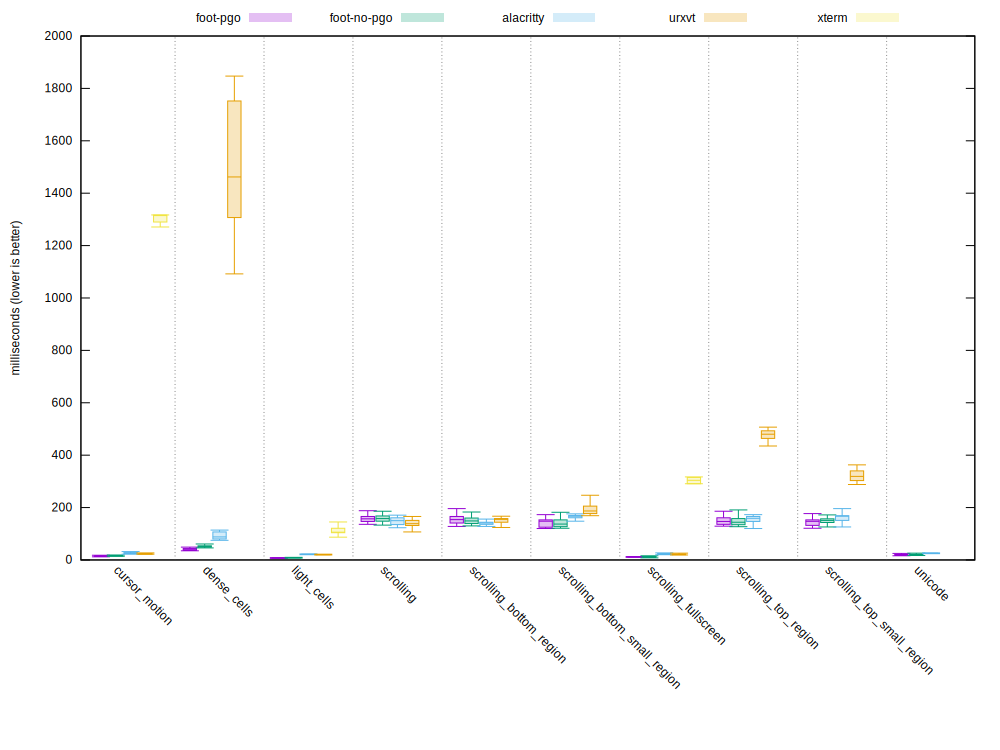

# Benchmarks

## vtebench

All benchmarks are done using [vtebench](https://github.com/alacritty/vtebench):

```sh
./target/release/vtebench -b ./benchmarks --dat /tmp/<terminal>
```

## 2021-06-25

### System

CPU: i9-9900

RAM: 64GB

Graphics: Radeon RX 5500XT


### Terminal configuration

Geometry: 2040x1884

Font: Fantasque Sans Mono 10.00pt/23px

Scrollback: 10000 lines


### Results

| Benchmark (times in ms)       | Foot (GCC+PGO) 1.8.0 | Foot 1.8.0 | Alacritty 0.8.0 | URxvt 9.26 | XTerm 368 |
|-------------------------------|---------------------:|-----------:|----------------:|-----------:|----------:|
| cursor motion                 |                12.93 |      15.37 |           26.47 |      23.41 |   1304.00 |
| dense cells                   |                39.16 |      47.19 |           87.26 |    9110.00 |  10883.00 |
| light cells                   |                 5.34 |       6.42 |           12.76 |      16.00 |     60.00 |
| scrollling                    |               144.26 |     139.93 |          133.98 |     117.52 |   3772.67 |
| scrolling bottom region       |               130.81 |     125.34 |          116.10 |     117.31 |   3574.67 |
| scrolling bottom small region |               142.46 |     127.52 |          127.32 |     135.18 |   3572.67 |
| scrolling fullscreen          |                 5.43 |       5.27 |           12.06 |      11.97 |    118.62 |
| scrolling top region          |               129.05 |     120.24 |          121.65 |     341.70 |   3567.33 |
| scrolling top small region    |               121.59 |     109.82 |          137.03 |     219.96 |   3558.67 |
| unicode                       |                12.03 |      11.95 |           13.94 |     667.67 |   4905.67 |


## 2021-03-20

### System

CPU: i5-8250U

RAM: 8GB

Graphics: Intel UHD Graphics 620


### Terminal configuration

Geometry: 945x1020

Font: Dina:pixelsize=12

Scrollback=10000 lines


### Results


| Benchmark (times in ms)       | Foot (GCC+PGO) 1.8.0 | Foot 1.8.0 | Alacritty 0.8.0 | URxvt 9.26 | XTerm 368 |
|-------------------------------|---------------------:|-----------:|----------------:|-----------:|----------:|
| cursor motion                 |                14.49 |      16.60 |           26.89 |      23.45 |   1303.38 |
| dense cells                   |                41.00 |      52.45 |           92.02 |    1486.57 |  11957.00 |
| light cells                   |                 7.97 |       8.54 |           21.43 |      20.45 |    111.96 |
| scrollling                    |               158.85 |     158.90 |          148.06 |     138.98 |  10083.00 |
| scrolling bottom region       |               153.83 |     151.38 |          142.13 |     151.30 |   9988.50 |
| scrolling bottom small region |               143.51 |     141.46 |          162.03 |     192.37 |   9938.00 |
| scrolling fullscreen          |                11.56 |      11.75 |           22.96 |      21.49 |    295.40 |
| scrolling top region          |               148.96 |     148.18 |          155.05 |     482.05 |  10036.00 |
| scrolling top small region    |               144.26 |     149.76 |          159.40 |     321.69 |   9942.50 |
| unicode                       |                21.02 |      22.09 |           25.79 |   14959.00 |  88697.00 |


